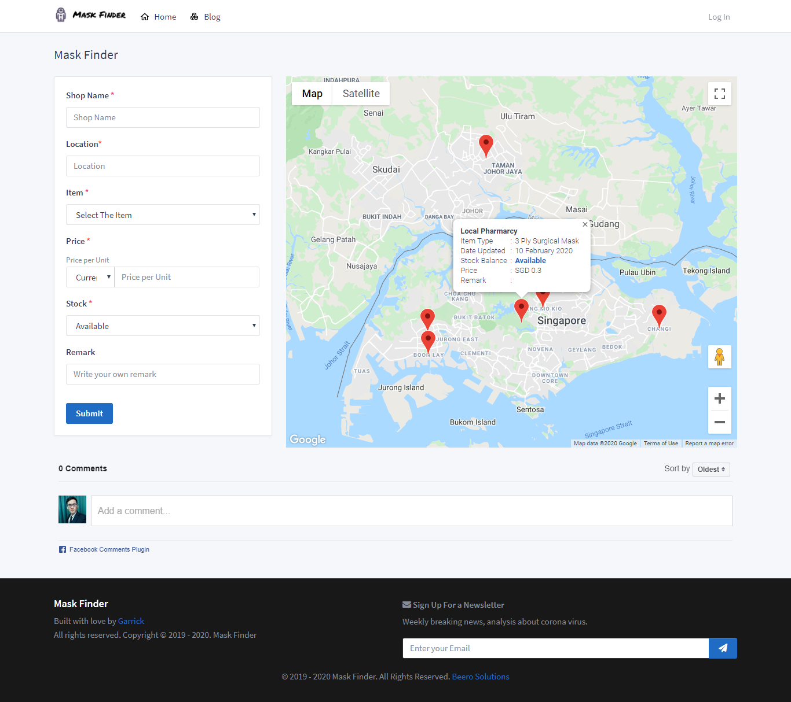

<p align="center"><a href="https://maskfinder.com" align="center"></a></p>

**[View Demo](https://maskfinder.com)**

## Mask Finder
Crowd Sourcing Apps to help public get their mask during Corona Virus Out Break Season

## Technology & Framework
This project is build using [PHP 7](https://www.php.net/) with [Codeigniter](https://codeigniter.com/) Framework.

Database is constructed using [MySql](https://www.mysql.com/).  

The UI Design is using [Tabler](https://tabler.io)

## Plugin Used
**Core**
- [Google Api](https://console.developers.google.com/)
- Google Geocode
- Google Map Javascript
- Google Map Places
- Google SDK

**Extra**  

- [Boostrap Notify](http://bootstrap-notify.remabledesigns.com/)

**Icon Used**
- [Font Awesome 5](https://fontawesome.com/)
- [icons8](https://icons8.com/icons/set/regular)

## Screenshots


## Code Structure
The project is built using MVC (Model View Controller) Structure.
`application/library/beero.php` is act as the backbone of this project.

The main view files will be `application\views\main.php`


## Installation
Kindly **register and activate Google Api** before the installation. Make sure you activated all the api stated above.

You can clone or download the file to your respective directory. Make sure your **PHP version is 7 and above**.

- Run Composer

```sh
composer update
```
- Extract `maskfinder.sql` to your database

- Edit your environment variable at `application\config\constants_example.php` and rename it to `application\config\constants.php`

- Run the server

## Contribute

Coming Soon. If you have any idea, feel free to contribute or drop me an email.

## Credits
Big thanks to [Codeigniter](https://codeigniter.com/) Team and [Tabler](https://tabler.io)

## Extra Note
There are more features coming in, stay tune!

I hope this project can really help the needs. So, feel free to fork this repo. A link back to my [website](https://maskfinder.com)  or my profile [https://garrickbee.github.io](https://garrickbee.github.io)  will be appreciated.
